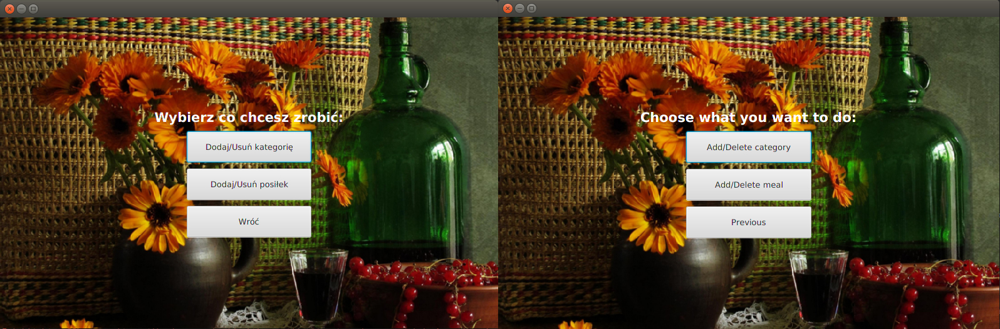

# BillingSystem
BillingSystem is educational project for managing restaurant. The idea was to create system to order meals from one restaurant. 

## The functionalities: 
* option to choose language (PL/EN)
* assigning meals to order in order panel
* adding and removing categories, meals in administration panel

## Architecture: 
* GUI written in JavaFX
* data stored in MySQL, manipulated with JDBC
* UI internationalization (Resource Bundle)
* MVP-like code orgamization

## Views: 

